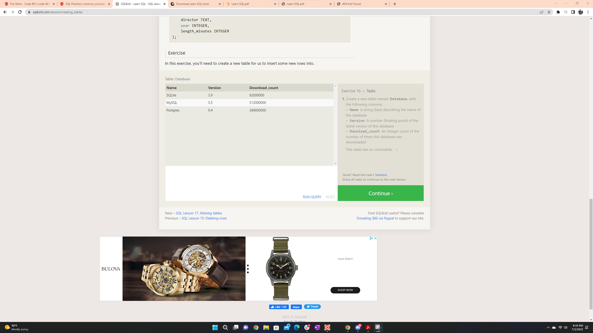

[Home](../README.md) > [Code 401 Topic Notes](../401topicNotes.md)

# SQL Practice

## What is SQL?

SQL is short for *Structured Query Language*. It is a language designed to allow people to query, manipulate, transform, etc. data from a relational database. It's intended to be a fairly simple framework that can provide safe and scalable storage.

To simplify a visualization of a SQL database, it can be thought of as a collection of excel tables. Some of them may relate to each other, and some of them may not.

## SQL Query Syntax

- To query data, we use SELECT and FROM statements. Very simply:

`SELECT *this data* FROM *this table*`

- When can also add constraints to our queries, including the use of different operators (=, !=, BETWEEN ... AND ..., are all examples):

`SELECT *this data* FROM *this table* WHERE *condition* (operator) *condition*`

- Additional operators can also compare strings, including case sensitivity (LIKE, NOT LIKE, %, etc.)

- Sorting queries can be done by choosing to **ORDER BY**, specifying the appropriate *column*, and then choosing **ASC or DESC**. You can also **LIMIT** the amount of results returned and provide an **OFFSET** to skip a set amount.

- Tables the share information about a single entity have a *primary key* that can be referenced in a query to **INNER JOIN** *table name* **ON** *reference*.

## SQL Database Management Syntax

- To manipulate our databases, we can insert new rows into our databases by using **INSERT INTO** and then the appropriate **VALUES** (list)

- To update we can **UPDATE** *table name* **SET** *column* = *value* **WHERE**

- Delete is done with **DELETE FROM** *table* **WHERE** *condition*

- Finally, we can create new tables, alter them, and drop them with the appropriate syntax.

## Sources

- [SQL Bolt](https://sqlbolt.com/)
- [Learn SQL](https://landing.chartio.com/download-learn-sql)

